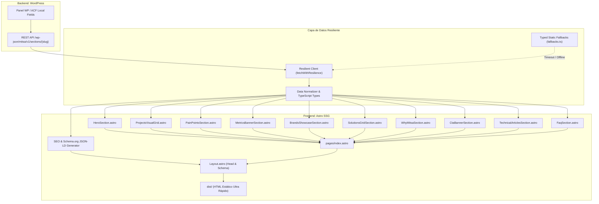

# Arquitectura del Sistema: Frontend Desacoplado & WordPress REST API

Este documento describe la arquitectura modular, escalable y desacoplada implementada para el proyecto web corporativo de **MITSA SpA** (mitsachile.com).

## Componentes y Responsabilidades

### 1. WordPress REST API Layer (`wp-content/themes/mitsa/inc/api-sections.php` & `acf-fields.php`)
- Expone el endpoint `/wp-json/mitsa/v1/sections/{slug}`.
- Grupos ACF versionados con PHP nativo:
  - `group_mitsa_hero_section`: Prefijo de H1, palabras rotativas, bajada, opciones de triaje.
  - `group_mitsa_visual_cards`: 4 tarjetas visuales con imagen, alt text, loading y dimensiones.
  - `group_mitsa_pain_points`: Cita de astillero, iniciales, rol y lista de resoluciones técnicas.
  - `group_mitsa_metrics`: Repeater de métricas de autoridad (`40+`, `5`, `100%`).
  - `group_mitsa_brands_showcase`: Repeater de 5 fabricantes representados con taglines y descripciones.
  - `group_mitsa_solutions`: Grid de 8 soluciones clave con imágenes y enlaces.
  - `group_mitsa_why_mitsa`: 6 razones técnicas, métricas destacadas y tarjeta de equipo en terreno.
  - `group_mitsa_cta_banner`: Título, bajada, botones de acción primaria/secundaria e imagen.
  - `group_mitsa_faqs`: Preguntas frecuentes de ingeniería expuestas también a Schema.org `FAQPage`.
  - `group_mitsa_seo_meta`: Meta título, meta descripción e imagen Open Graph.
- Añade cabeceras HTTP de caché (`Cache-Control: public, max-age=300, stale-while-revalidate=86400`).

### 2. Capa de Resiliencia en Frontend (`frontend/src/lib/api/`)
- `types.ts`: Define los contratos de interfaces TypeScript estrictos para cada bloque.
- `fallbacks.ts`: Provee dataset estático tipado de respaldo garantizando cero caídas ante servidores caídos.
- `client.ts`: Ejecuta llamadas HTTP con timeout estricto (3500ms), reintentos transparentes y fallback automático.

### 3. Capa de Componentes Modulares (`frontend/src/components/sections/`)
- `HeroSection.astro`: H1 semántico, rotador CSS con `@media (prefers-reduced-motion: reduce)`, live regions y triaje.
- `ProjectsVisualGrid.astro`: Grid visual con `loading="eager"` y `fetchpriority="high"` en la imagen prioritaria para LCP, y dimensiones fijas para CLS = 0.
- `PainPointsSection.astro`: Objeciones y resoluciones de astilleros navales.
- `MetricsBannerSection.astro`: Métricas de autoridad y trayectoria.
- `BrandsShowcaseSection.astro`: Showcase oficial de EVAC, Cathelco, ERMA FIRST, EPE, BLÜCHER.
- `SolutionsGridSection.astro`: 8 soluciones tecnológicas con imágenes optimizadas y enlaces de consulta técnica.
- `WhyMitsaSection.astro`: Propuesta de valor, diferenciadores y equipo en terreno.
- `CtaBannerSection.astro`: Banner de evaluación técnica con botones accesibles (>= 44x44px).
- `TechnicalArticlesSection.astro`: Cluster de guías técnicas y regulatorias (Blog SEO).
- `FaqSection.astro`: Preguntas frecuentes con elementos accesibles `
` y `
` sincronizados con Schema.org `FAQPage`.
