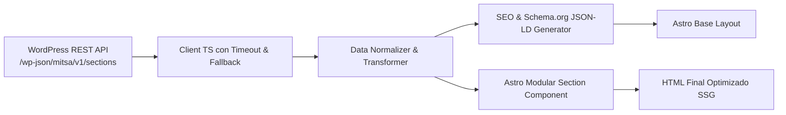

# Flujo de Ingesta y Procesamiento de Contenido (WP REST API → Frontend)

Este workflow gobierna cómo se ingieren, normalizan y renderizan los contenidos administrables desde WordPress hacia el frontend desacoplado.

## Etapas del Flujo

1. **Definición en WordPress (Backend)**:
   - Los editores gestionan textos, llamadas a la acción, títulos, selectores de triaje e imágenes desde el panel de WordPress.
   - La API expone los datos mediante endpoints estructurados `/wp-json/mitsa/v1/sections/{slug}` con sanitización nativa y cache headers.
2. **Consumo Resiliente (Frontend Client)**:
   - El cliente `fetchSectionData` invoca la API con un timeout estricto de 4 segundos.
   - Si la API responde exitosamente (HTTP 200), se valida la estructura.
   - Si la API falla, hay timeout o error 5xx, se activa inmediatamente el dataset estático local tipado, sin detener la compilación ni arrojar errores al usuario.
3. **Normalización y Tipado**:
   - Los datos crudos se transforman en modelos de datos tipados (TypeScript interfaces / Zod schemas), garantizando que los componentes de Astro reciban props seguras y limpias.
4. **Enriquecimiento SEO & Schema.org**:
   - Se generan metadatos Open Graph, Twitter cards, meta descriptions y el grafo JSON-LD unificado (`@graph`).
5. **Renderizado de la Sección**:
   - El componente de Astro procesa las props y genera HTML semántico, ultra-liviano, con soporte de accesibilidad y optimización de imágenes nativa.
