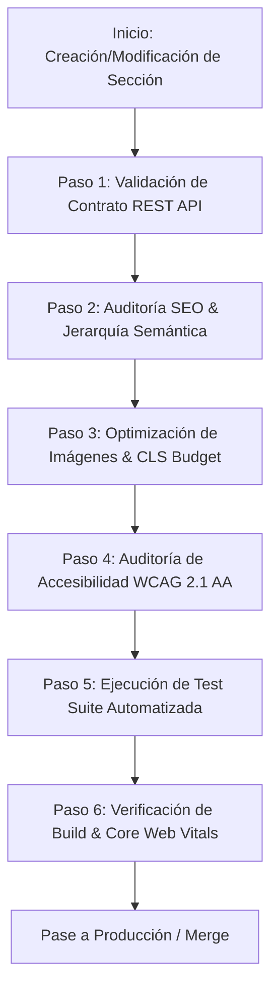

# Flujo de Validación y Control de Calidad de Secciones (Quality Gate)

Este workflow define los 6 pasos obligatorios que cada componente y sección debe superar antes de considerarse **Production-Ready**.

## Protocolo de los 6 Pasos

### 1. Validación de Contrato REST API
- Verificar que el endpoint de WordPress `/wp-json/mitsa/v1/sections/{slug}` exponga todos los campos necesarios.
- Comprobar que todos los textos, imágenes y enlaces sean 100% editables desde WP.
- Validar que el cliente en TypeScript maneje fallos de red, timeouts y fallback con gracia.

### 2. Auditoría SEO & Jerarquía Semántica
- Verificar un único `<h1>` por página, alineado a palabras clave estratégicas (BWTS, ICCP, Ósmosis Inversa, etc.).
- Subtítulos de sección en `<h2>` y tarjetas en `<h3>`.
- Validar la generación de Schema.org JSON-LD sintácticamente válido (sin errores en Google Rich Results Validator).

### 3. Optimización de Imágenes & CLS Budget
- Above-the-fold (Hero): `loading="eager"`, `decoding="async"`, `fetchpriority="high"`.
- Below-the-fold: `loading="lazy"`, `decoding="async"`.
- `width` y `height` o `aspect-ratio` definidos para asegurar CLS = 0.
- `alt` text dinámico desde WordPress, libre de palabras redundantes.

### 4. Auditoría de Accesibilidad WCAG 2.1 AA
- Contraste de color superior a 4.5:1 para texto estándar y 3:1 para elementos gráficos.
- Todos los controles interactivos accesibles por teclado con `:focus-visible` definido.
- Formularios y entradas con `aria-label` o etiquetas explícitas.
- Regiones dinámicas marcadas con `aria-live="polite"`.

### 5. Ejecución de Tests Automatizados
- Ejecutar `npm test` o el runner de pruebas unitarias/integración de Node.
- Validar contratos de API, renderizado de fallbacks, generador de SEO y reglas de accesibilidad.

### 6. Compilación y Validación de Core Web Vitals
- Compilar el proyecto con `npm run build`.
- Verificar que no existan advertencias de compilación ni errores de rutas estáticas.
