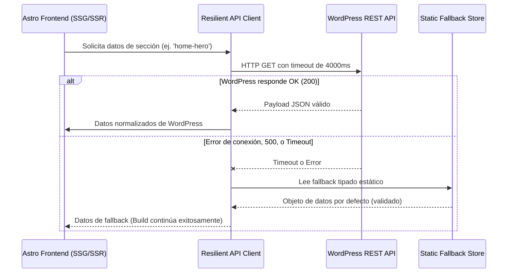

# Protocolo de Resiliencia y Fallback Offline (Zero-Downtime Architecture)

Este documento detalla la estrategia de tolerancia a fallos del frontend ante caídas, reinicios o lentitud del servidor WordPress.

## Beneficios Clave

1. **Compilación Ininterrumpida**: Los deploys en CI/CD y las construcciones locales nunca fallan aunque el servidor local o remoto de WordPress esté temporalmente inactivo.
2. **Cero Degradación de Rendimiento**: El SSG genera el HTML completo independientemente del estado de la base de datos en tiempo real.
3. **Consistencia de Tipos**: Tanto los datos vivos de la API como los fallbacks comparten la misma interfaz de TypeScript, evitando excepciones por campos indefinidos en tiempo de ejecución.
